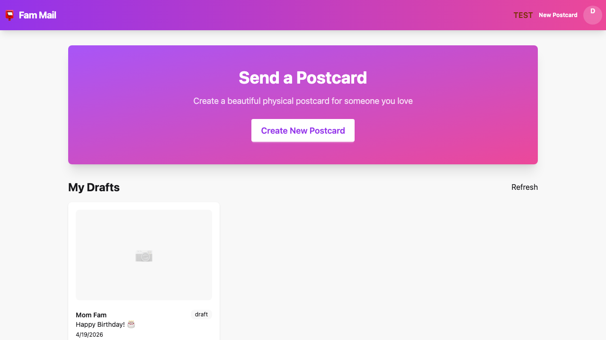
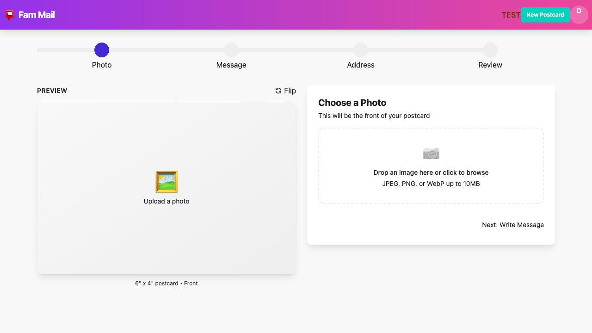
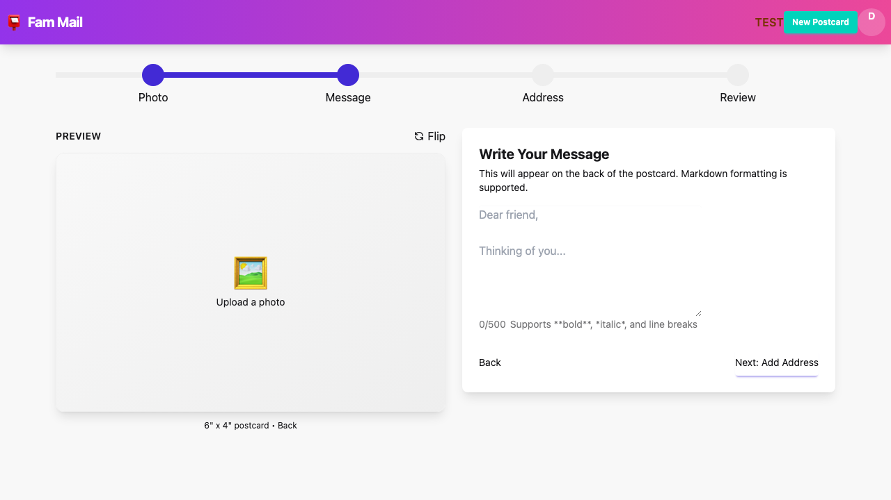
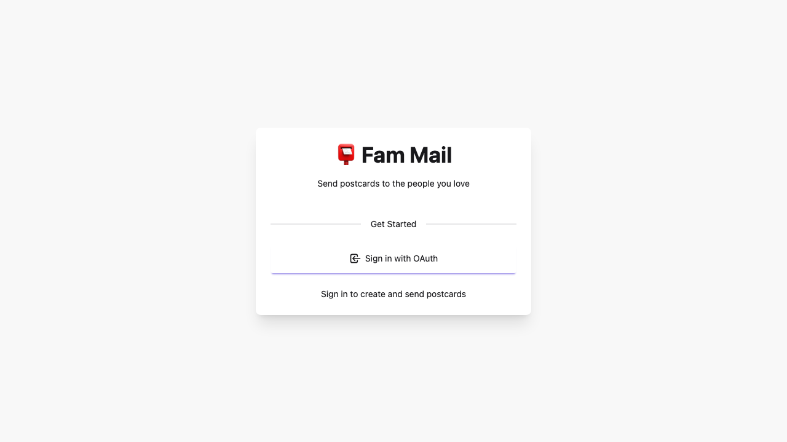

# Fam Mail

[](https://github.com/NickLewanowicz/fam-mail/actions/workflows/ci.yml)
[](LICENSE)

Send physical postcards through a web UI backed by [PostGrid](https://www.postgrid.com/) (printing and USPS delivery).

## What it does

Fam Mail is a small full-stack app for composing a postcard (photo, message, addresses), previewing front and back, and submitting it to PostGrid. An optional **email-to-postcard** mode can watch an IMAP mailbox, parse requests with an LLM, and create mail automatically when that stack is configured.

## Features

- [x] **Postcard builder** — Image upload, Markdown message, US/CA address validation, live preview
- [x] **Drafts API** — Save and resume work via the REST API (used by the UI)
- [x] **OIDC sign-in** — Google or any OIDC provider, with JWT access and refresh cookies
- [x] **PostGrid** — Test mode for development, live mode for real mail, optional mock mode
- [x] **Hardening** — Central security headers, CORS, rate limits on auth and costly routes
- [x] **SQLite** — Users, drafts, sessions, and (when enabled) email pipeline state
- [x] **Docker** — One image: API plus built static frontend on a single port
- [x] **Tests** — Backend (`bun test`) and frontend (`vitest`) unit tests; Playwright E2E

## Tech stack

| Layer | Technology |
|-------|------------|
| Backend | Bun, TypeScript, SQLite |
| Frontend | Vite, React 18, TypeScript, Tailwind CSS, DaisyUI |
| Auth | OIDC + JWT |
| Mail | PostGrid |
| E2E | Playwright |
| Package manager | pnpm workspaces |

## Screenshots

### Dashboard



### Create postcard





### Login



## Documentation

- [Contributing](docs/CONTRIBUTING.md) — How to contribute to the project
- [Security Policy](SECURITY.md) — Security guidelines and vulnerability reporting
- [Changelog](CHANGELOG.md) — Version history and notable changes

## Quick start with Docker

1. Copy the environment template and set at least PostGrid and OIDC values (see [Environment variables](#environment-variables)).

   ```bash
   cp .env.example .env
   ```

2. Build and start the stack (API and static UI on **port 8484**).

   ```bash
   docker compose up --build -d
   ```

3. Open [http://localhost:8484](http://localhost:8484) (or your host / reverse proxy). Set `OIDC_REDIRECT_URI` and any public URL variables so they match how users reach the app.

For a development loop with hot reload, use [Quick start (development)](#quick-start-development) instead.

## Quick start (development)

### Prerequisites

- [Bun](https://bun.sh/) 1.x
- [pnpm](https://pnpm.io/) 8+
- A PostGrid account (test keys are enough for development)

### Install

```bash
pnpm install
```

### Environment

The backend process loads `.env` from the **`backend/`** package directory when you use `pnpm dev`.

```bash
cp backend/.env.example backend/.env
```

Edit `backend/.env`. Minimum for the web UI and API:

```env
POSTGRID_MODE=test
POSTGRID_TEST_API_KEY=your_test_key
POSTGRID_LIVE_API_KEY=your_live_key

OIDC_ISSUER_URL=https://accounts.google.com/.well-known/openid-configuration
OIDC_CLIENT_ID=your_google_client_id
OIDC_CLIENT_SECRET=your_google_client_secret
OIDC_REDIRECT_URI=http://localhost:8484/api/auth/callback
JWT_SECRET=your-secret-at-least-32-characters-long
```

See `backend/.env.example` and the root `.env.example` for the full variable list (IMAP, LLM, webhooks, etc.).

### Run

```bash
pnpm dev
```

- Frontend dev server: `http://localhost:5173` (proxies `/api` to the backend)
- Backend: `http://localhost:8484`

For production-like local behavior (single origin), build the frontend and run the backend with `NODE_ENV=production` so it serves `frontend/dist` from the same port as the API.

## API overview

Responses are JSON unless the server is serving static assets. Authenticated routes use `Authorization: Bearer <access_token>`.

| Area | Description |
|------|-------------|
| Health | System health and dependency checks |
| Auth | OIDC login, token management, user info |
| Postcards | Direct postcard creation and sending |
| Drafts | Draft CRUD, publish, schedule management |
| PostGrid | Service status and mode toggling |
| Webhooks | Email-to-postcard webhook processing |

See [docs/API.md](docs/API.md) for full request/response schemas, authentication details, and error codes.

## Commands

```bash
pnpm dev          # Frontend + backend in watch mode
pnpm build        # Production build (all workspace packages)
pnpm test         # Backend + frontend unit tests
pnpm lint         # Lint all packages

pnpm --filter backend test
pnpm --filter frontend test
```

## Repository layout

```
fam-mail/
├── backend/src/     # HTTP server, routes, PostGrid, auth, DB
├── frontend/src/    # React UI
├── docs/            # Contributing, architecture notes, README screenshots
├── docker-compose.yml
├── Dockerfile
└── pnpm-workspace.yaml
```

Project-specific OpenCode / Claude Code configuration lives under `.opencode/` for contributors who use those tools.

## Docker (details)

The image installs workspace dependencies, runs `pnpm build` in `frontend`, bundles the backend with `bun build`, and copies `frontend/dist` next to the backend so **one process on port 8484** serves the API and static UI. The [Quick start with Docker](#quick-start-with-docker) section above covers the usual `docker compose` workflow.

## Environment variables

See `.env.example` and `backend/.env.example`. Groupings include PostGrid, OIDC/JWT, server port and database path, optional IMAP and LLM settings for the email pipeline, and webhook secrets.

## Contributing

See [docs/CONTRIBUTING.md](docs/CONTRIBUTING.md).

## License

MIT — see [LICENSE](LICENSE).
