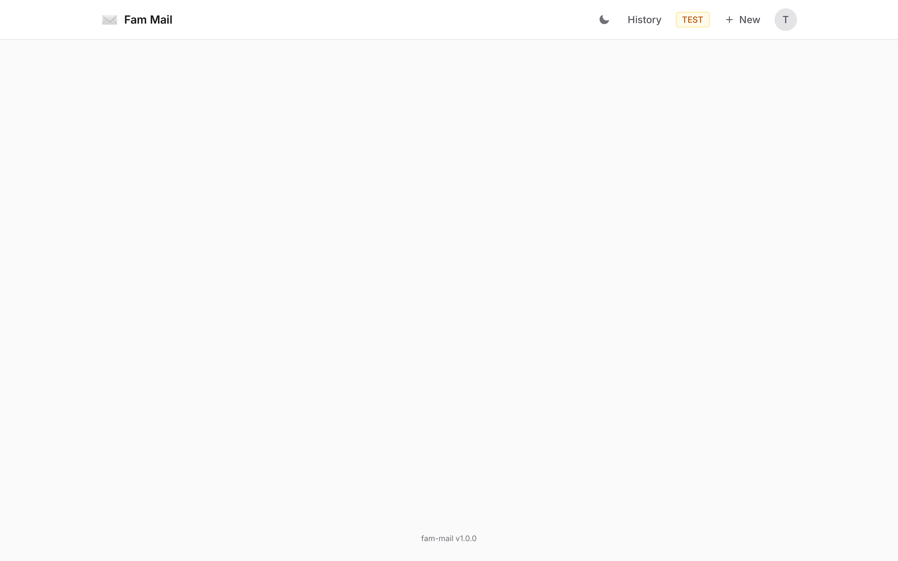
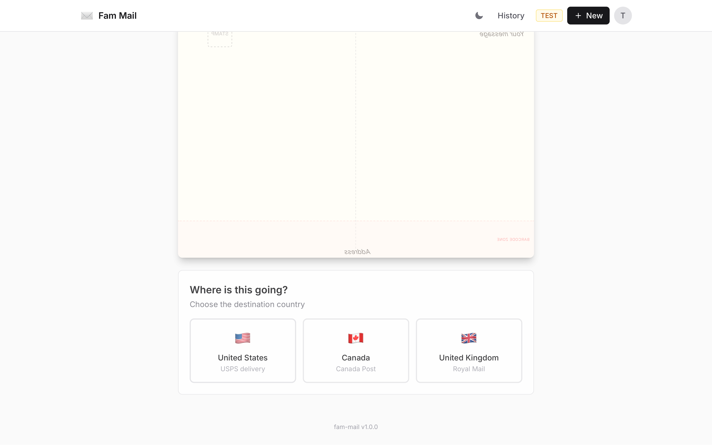
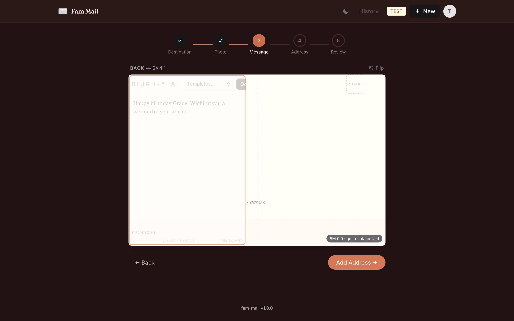
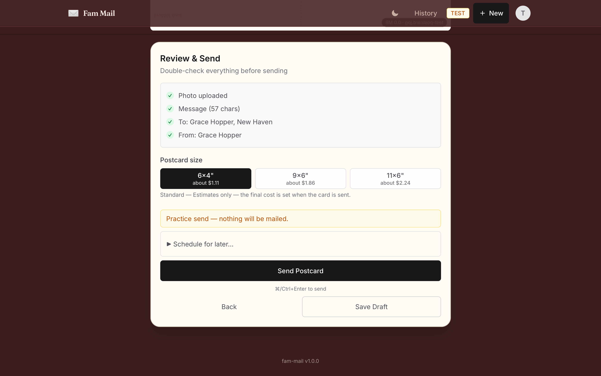
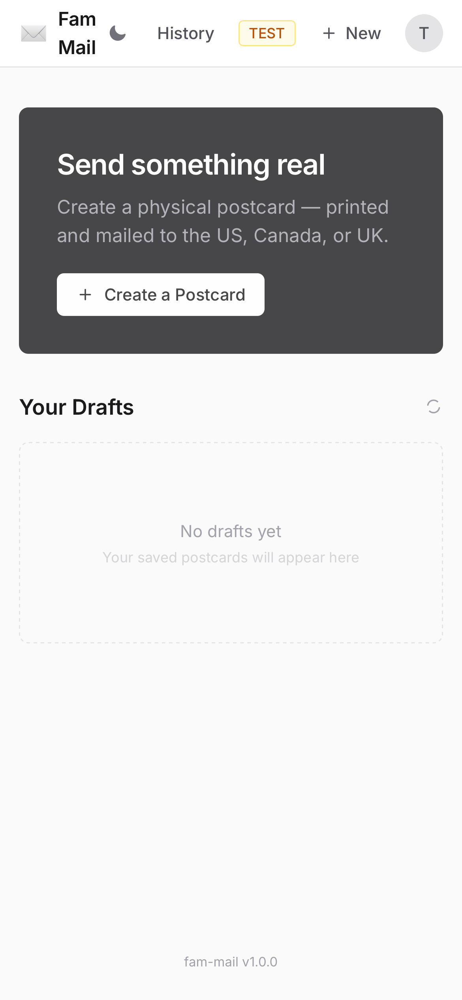
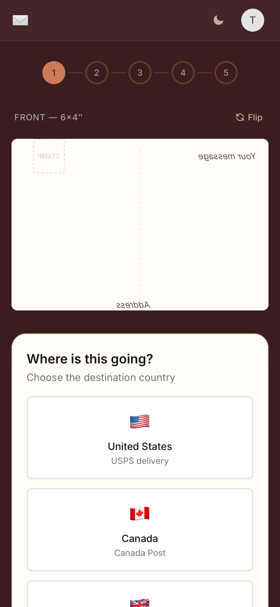
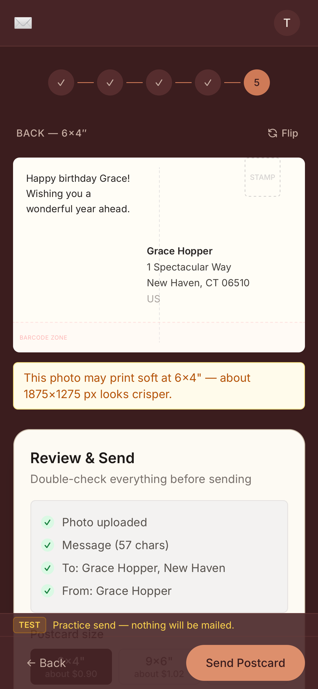
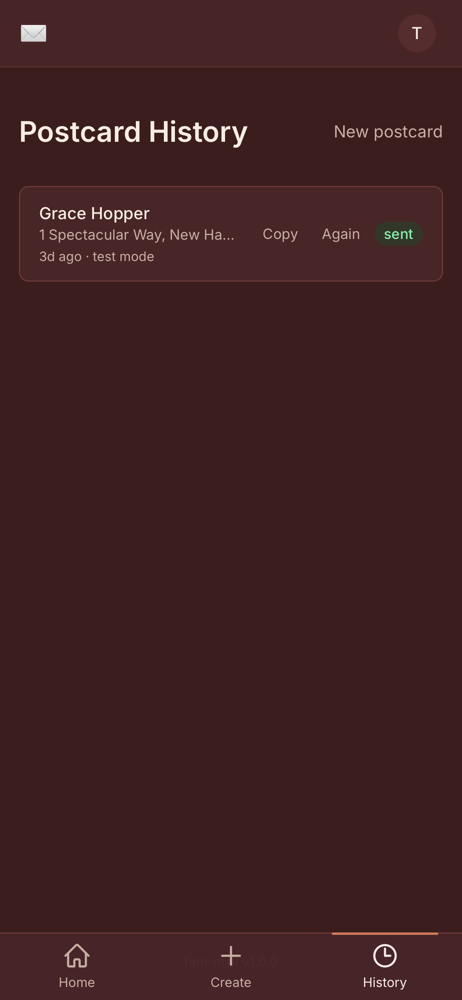

# Fam Mail

[](https://github.com/NickLewanowicz/fam-mail/actions/workflows/ci.yml)
[](LICENSE)

Turn a photo and a few words into a **real postcard** in someone's mailbox. Fam Mail is a small,
self-hosted web app for sending sentimental, physical postcards to the family and friends you
actually miss — compose a card in the browser, preview exactly what will print, and PostGrid handles
the printing and postage (USPS, Canada Post, Royal Mail).

Built for memory-making, not marketing: one card, one person, at a time.

## What it does

Compose postcards (photo, Markdown message, addresses) in a 5-step wizard, preview front and back
with country-specific safe zones, and submit to PostGrid for real printing and mailing. Save drafts,
schedule cards for later, resend a favorite with one tap, and track everything in your history. An
optional **email-to-postcard** mode (paused, experimental) can watch an IMAP mailbox, parse requests
with an LLM, and create mail automatically.

## Features

- [x] **5-step postcard wizard** — Destination, photo upload, rich text message, address entry, review & send
- [x] **Live 3D-flip preview** — country-specific safe zones (US, CA, GB) and real card sizes (6×4″, 9×6″, 11×6″)
- [x] **Rich text messages** — bold, italic, headings, lists, and text colors that render on the printed card
- [x] **Drafts & history** — save and resume; "Again" restores a past card's photo, message, and recipient
- [x] **Schedule sends** — queue a card for a birthday or anniversary
- [x] **Honest pricing** — per-country, per-size estimates shown before you send (US, Canada; more coming)
- [x] **OIDC sign-in** — any OIDC provider with JWT access/refresh tokens; single-use ticket exchange, tokens never in URLs
- [x] **Agent API** — static API keys (`/api/v1`) so assistants and scripts can send postcards on your behalf
- [x] **Print safety** — format, size, and corruption checks; low-resolution warnings; XSS-sanitized content
- [x] **Mobile-first** — bottom tab bar, thumb-zone actions, and animations that feel at home on a phone
- [x] **PostGrid integration** — test mode, live mode, or mock mode
- [x] **SQLite** — users, drafts, sessions, and sent-card history (self-host friendly)
- [x] **Docker** — one image serves the API and the static frontend on one port
- [x] **Tests** — backend (`bun test`, network-isolated) and frontend (`vitest`) suites

## Tech stack

| Layer | Technology |
|-------|------------|
| Backend | Bun, TypeScript, SQLite |
| Frontend | Vite, React 18, TypeScript, Tailwind CSS, DaisyUI 5, Framer Motion |
| Auth | OIDC + JWT |
| Mail | PostGrid |
| Package manager | pnpm workspaces |

## Screenshots

### Desktop (1280×800)

| Dashboard | Photo Upload |
|:---:|:---:|
|  |  |

| Message Editor | Review & Send |
|:---:|:---:|
|  |  |

### Mobile (390×844)

| Dashboard | Destination |
|:---:|:---:|
|  |  |

| Review | History |
|:---:|:---:|
|  |  |

## Roadmap

Things I'm excited about, roughly in the order I'll get to them:

- **LLM assistant integration** *(messing with it locally now)* — the Agent API (`/api/v1`) is live
  and API-key authenticated; the plan is to make it pleasant for LLM agents like Hermes or OpenClaw
  to compose and send real cards on your behalf: "send Mom a birthday card" should just work.
- **More countries & rates** — GB pricing via PostGrid sales contact, then EU expansion.
- **Print-quality guardrails** — smarter low-resolution handling (auto-downscale/upscale suggestions
  at upload; the current amber warning is step one).
- **Email-to-postcard revival** — the paused IMAP + LLM pipeline, rebuilt on the current stack.

## Documentation

| Document | Description |
|----------|-------------|
| [Docs index](docs/README.md) | Start here — hub for all documentation |
| [Architecture](docs/ARCHITECTURE-1.0.0.md) | System design and data flow |
| [Deployment](docs/DEPLOYMENT.md) | Production setup, Docker, nginx |
| [API Reference](docs/API.md) | HTTP endpoints and schemas |
| [Agent API](docs/agent-api.md) | Machine API keys for assistants and automation |
| [Product decisions](docs/product-decisions.md) | Maintainer product decision log |
| [ADR Index](docs/adr/) | Architecture decision records (0001–0004) |
| [Contributing](docs/CONTRIBUTING.md) | Development workflow and PR guidelines |
| [Security Policy](SECURITY.md) | Security guidelines and vulnerability reporting |
| [Troubleshooting](docs/troubleshooting.md) | Common self-hosting issues and fixes |
| [FAQ](docs/FAQ.md) | Quick answers to common questions |
| [Upgrading](UPGRADING.md) | Backup → pull → restart, rollback |
| [Support](SUPPORT.md) | How to get help (and what best-effort means) |
| [Environment Reference](docs/environment.md) | Every env var, default, and requirement |
| [Screenshots manifest](docs/screenshots/README.md) | What each screenshot shows + how to regenerate |
| [Changelog](CHANGELOG.md) | Version history and notable changes |
| [Feature Board](docs/FEATURES.md) | Roadmap and enhancement log |
| [Backups](scripts/backup.sh) | SQLite-safe backup script |

## Quick start with Docker

1. Copy the environment template and set at least PostGrid and OIDC values (see [Environment variables](#environment-variables)).

   ```bash
   cp .env.example .env
   ```

2. Build and start the stack (API and static UI on **port 8484**).

   ```bash
   docker compose up --build -d
   ```

3. Open [http://localhost:8484](http://localhost:8484) (or your host / reverse proxy). Set `OIDC_REDIRECT_URI` and any public URL variables so they match how users reach the app.

For a development loop with hot reload, use [Quick start (development)](#quick-start-development) instead.

## Quick start (development)

### Prerequisites

- [Bun](https://bun.sh/) 1.x
- [pnpm](https://pnpm.io/) 8+
- A PostGrid account (test keys are enough for development)

### Install

```bash
pnpm install
```

### Environment

The backend process loads `.env` from the **`backend/`** package directory when you use `pnpm dev`.

```bash
cp backend/.env.example backend/.env
```

Edit `backend/.env`. Minimum for the web UI and API:

```env
POSTGRID_MODE=test
POSTGRID_TEST_API_KEY=your_test_key
POSTGRID_LIVE_API_KEY=your_live_key

OIDC_ISSUER_URL=https://accounts.google.com/.well-known/openid-configuration
OIDC_CLIENT_ID=your_google_client_id
OIDC_CLIENT_SECRET=your_google_client_secret
OIDC_REDIRECT_URI=http://localhost:8484/api/auth/callback
JWT_SECRET=your-secret-at-least-32-characters-long
```

For quick local testing without an OIDC provider, set `DEV_MODE=true` to bypass authentication and
auto-create a dev user.

See `backend/.env.example` and the root `.env.example` for the full variable list (IMAP, LLM,
pricing, webhooks, etc.).

### Run

```bash
pnpm dev
```

- Frontend dev server: `http://localhost:5173` (proxies `/api` to the backend)
- Backend: `http://localhost:8484`

For production-like local behavior (single origin), build the frontend and run the backend with `NODE_ENV=production` so it serves `frontend/dist` from the same port as the API.

## API overview

Responses are JSON unless the server is serving static assets. Authenticated routes use `Authorization: Bearer <access_token>`.

| Area | Description |
|------|-------------|
| Health | System health and dependency checks |
| Auth | OIDC login, single-use ticket exchange, token management, user info |
| Postcards | Direct postcard creation and sending |
| Drafts | Draft CRUD, publish, schedule management |
| PostGrid | Service status, mode toggling (admins only), per-country pricing |
| Webhooks | Email-to-postcard webhook processing |
| **Agent API** | `/api/v1` — API-key auth for machine integrations |

See [docs/API.md](docs/API.md) for full request/response schemas, authentication details, and error codes. Agents and automations: see [docs/agent-api.md](docs/agent-api.md).

## Commands

```bash
pnpm dev          # Frontend + backend in watch mode
pnpm build        # Production build (all workspace packages)
pnpm test         # Backend + frontend unit tests
pnpm lint         # Lint all packages

pnpm --filter backend test
pnpm --filter frontend test
```

Regenerate the documentation screenshots:

```bash
cd frontend && npx playwright test capture.spec
```

See the [screenshots manifest](docs/screenshots/README.md) for what each image shows.

## Repository layout

```
fam-mail/
├── backend/src/     # HTTP server, routes, PostGrid, auth, DB
├── frontend/src/    # React UI
├── docs/            # Docs hub, API reference, ADRs, screenshots
├── docker-compose.yml
├── Dockerfile
└── pnpm-workspace.yaml
```

Agent configuration lives under `.claude/` for contributors who use AI coding tools.

## Docker (details)

The image installs workspace dependencies, runs `pnpm build` in `frontend`, bundles the backend with `bun build`, and copies `frontend/dist` next to the backend so **one process on port 8484** serves the API and static UI. The [Quick start with Docker](#quick-start-with-docker) section above covers the usual `docker compose` workflow.

## Environment variables

See `.env.example` and `backend/.env.example`. Groupings include PostGrid (mode, keys, per-country pricing), OIDC/JWT, server port and database path, optional IMAP and LLM settings for the email pipeline, and webhook secrets.

## Honest limits & alternatives

Fam-mail is a small, single-maintainer tool with a narrow focus: composing
postcards and handing them to PostGrid. It is deliberately **not**:

- a CRM or full address book (recipients are entered per card),
- a marketing/bulk-mail tool (rate limits are intentionally tight — it costs
  real money per card),
- a hosted service — you run it, you own the database and the PostGrid bill.

If you need bulk mail merges, address verification APIs, or template-heavy
campaigns, look at PostGrid's own dashboard tools or a marketing-mail platform
instead. If you want a tiny, honest postcard app you can read the whole source
of in an afternoon — welcome, this is it.

## Contributing

PRs welcome. Development happens with AI assistance under human review — see
[CONTRIBUTING](docs/CONTRIBUTING.md) for the workflow and conventions.

## License

MIT — see [LICENSE](LICENSE).
